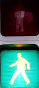
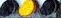

## このリポジトリについて
信号機の色を認識するリポジトリです。</br>
UMAPの潜在空間で得た特徴量をSVMによりクラス分類することを目指します。</br></br>

クラスタリングにより色認識をするリポジトリとは違います。</br>
→ https://github.com/tanik12/color_clustering</br>

また、今回はつくばチャレンジ用に学習をさせています。</br>
※python3で物体認識モデルができています。

## 認識できるものについて
◆色認識モデル</br>
　車両用信号機と歩行者用信号機の色を認識します。</br>
　赤、黄、青、unkownの4クラスです。</br>
　下記の画像例のような信号機の色を認識します。(画像はdataフォルダ下にあります。)</br></br>
　
　
　
　
　

　※注意</br>
　 ・上記の画像例は、信号機認識モデルの出力から取得した画像として想定しています。</br>
　 ・信号機が横を向いていたり、暗い又は遠すぎていと識別しづらい時にunkownが出ます。</br>

## 環境構築手順
しばらくお待ちください。</br>

## 使い方
◆学習済みモデルを使って推論をする。</br>
```
python inf_test.py
```
◆学習をさせたい(コードの整理中...少々お待ちください。)
```
python main.py
```
